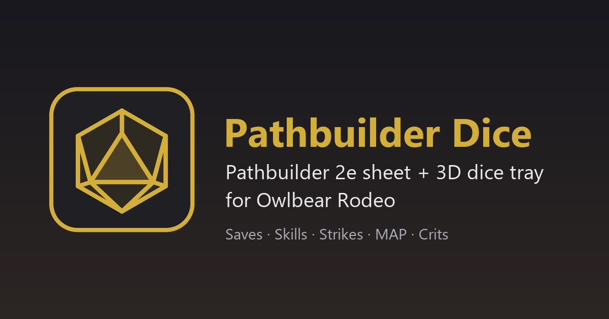

# Pathbuilder Dice para Owlbear Rodeo



Extensión para [Owlbear Rodeo](https://www.owlbear.rodeo) que abre tu personaje de
**Pathbuilder 2e** como hoja dentro de la mesa y hace que las tiradas (salvaciones,
habilidades, golpes con MAP, daño y críticos) caigan como **dados 3D en la bandeja**,
visibles para todos los jugadores.

> Extensión no oficial. No está afiliada a Pathbuilder 2e ni a Owlbear Rodeo.
> Los dados 3D son un fork de [Owlbear Rodeo Dice](https://github.com/owlbear-rodeo/dice) (GPL-3.0).

## Qué incluye

| Pieza | Para qué |
|---|---|
| **Bandeja de dados 3D** | La bandeja de Owlbear Rodeo Dice, que además recibe tiradas con nombre ("Will Save", "Longsword: To Hit"). |
| **Botón «Hoja de personaje»** | Abre un panel grande con cuatro pestañas: Pathbuilder, Hoja nativa, Registro y Ajustes. |
| **Pestaña Pathbuilder** | Pathbuilder 2e completo dentro de Owlbear. Requiere la [extensión compañera](companion/README.md) (Chrome/Edge). |
| **Pestaña Hoja nativa** | Importa tu personaje (ID de exportación JSON) y tira desde Owlbear sin instalar nada en el navegador. |
| **Registro** | Historial de tiradas de toda la sala. |
| **Ajustes** | Tirar en 3D o solo anunciar el resultado de Pathbuilder, notificaciones y webhook de Discord. |

## Instalación

### 1. En Owlbear Rodeo (el GM, una vez por sala)
Perfil → **Extensions** → **Add Custom Extension** y pega:

```
https://gmredvelvet-rgb.github.io/owlbear-pathbuilder-dice/manifest.json
```

Luego actívala en la sala. Puedes tenerla junto al Dice oficial, porque usan datos separados.

### 2. Extensión compañera (cada jugador que quiera Pathbuilder dentro del panel)
1. Descarga [companion.zip](https://gmredvelvet-rgb.github.io/owlbear-pathbuilder-dice/companion.zip) y descomprímelo.
2. Abre `chrome://extensions` (o `edge://extensions`) y activa el **Modo de desarrollador**.
3. Pulsa **Cargar descomprimida** y elige la carpeta.
4. Recarga Owlbear Rodeo.

La hoja nativa no necesita este paso.

## Uso
1. Abre la bandeja (icono del d20 dorado) y pulsa el botón **Hoja de personaje** de la barra lateral.
2. **Pathbuilder:** abre tu personaje y tira como siempre. Cada tirada se repite con dados 3D en la bandeja, con su nombre, y toda la sala recibe una notificación.
3. **Hoja nativa:** en Pathbuilder ve a ☰ → Export → *Export JSON* y copia el número. Pégalo en la pestaña. Cada botón tira: Percepción, salvaciones, habilidades, saberes, golpes (tres botones: sin MAP, −5/−10 o −4/−8 si es ágil), daño y crítico. Tienes modificador situacional, fortuna/infortunio y tirada oculta.

## Cómo funciona

```
Owlbear Rodeo
├── Bandeja (index.html)  ◄── BroadcastChannel + cola ──┐
├── Hoja (sheet.html) ──────────────────────────────────┘
│     └── iframe pathbuilder2e.com ◄── content script de la extensión compañera
└── Background (background.html) → notificaciones de la sala
```

- Pathbuilder bloquea que lo metan en otras webs (`X-Frame-Options`). La extensión compañera quita esa cabecera **solo** cuando el iframe lo abre esta extensión, y reenvía las tiradas con `postMessage`.
- Las tiradas viajan dentro de la metadata del jugador (como en el Dice original). Así los demás ven caer los dados en su bandeja flotante.
- Detalle técnico y riesgos: [docs/PLAN.md](docs/PLAN.md). Pruebas manuales: [docs/TESTING.md](docs/TESTING.md).

## Desarrollo

```bash
npm install
npm run dev        # http://localhost:5173/manifest.json → "Add Custom Extension"
npm test           # parser de tiradas y cálculos de personaje
npm run build      # SITE_URL=https://.../ para compilar con otra URL
```

La extensión compañera ya permite `localhost`. Para servir desde otro dominio, añádelo en
`companion/rules.json`, `companion/manifest.json` (`host_permissions`) y `ALLOWED_PARENTS` en
`companion/content.js`.

GitHub Actions ejecuta las pruebas, compila y publica en GitHub Pages en cada push a `main`.
También incluye `companion.zip`.

## Licencia
GPL-3.0, igual que el proyecto original. Consulta [LICENSE](LICENSE) y [NOTICE.md](NOTICE.md).
